原项目地址：

https://github.com/AgentGuo/PFSafetyGuard


本人成功复现了该项目，简单修改了部分代码，添加了部分注释和说明后重新上传。同时根据自己的调试过程完善了部分文档。


# 运行环境


- Visual Studio 2019
- QT版本：5.12.12
- Detour版本：4.0.1
- 所有代码均在x86下编译通过


# 项目介绍


该项目有四个组成部分：

1. testCode：测试程序，主要包含一些我们需要抓取的API和异常操作
2. PFDLL：定义了需要HOOK的winAPI和替换的函数
3. syringe：注射器程序，主要将PFDLL程序中的替换函数替换测试程序testCode中的API
4. PFSafetyGuard：图形界面程序，接收PFDLL程序勾取的信息，然后做一些行为异常分析


# 详细配置过程


## Detour


首先配置Detours


> 参考链接：https://blog.csdn.net/weixin_44338712/article/details/115261358


首先在[Detours-github](https://github.com/microsoft/detours)下载Detours源码，然后解压，得到以下内容：

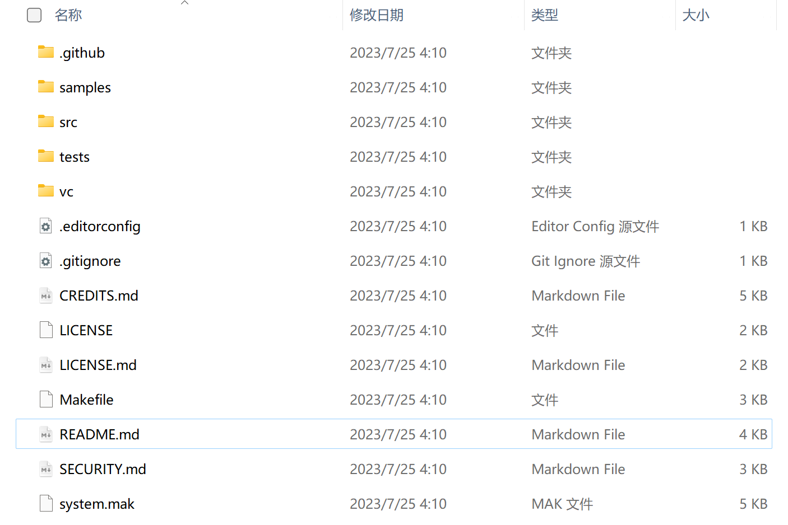


在当前目录下，使用**x86** Native Tools Command Prompt for VS 2022执行命令：


```
nmake /f Makefile
```


编译成功：

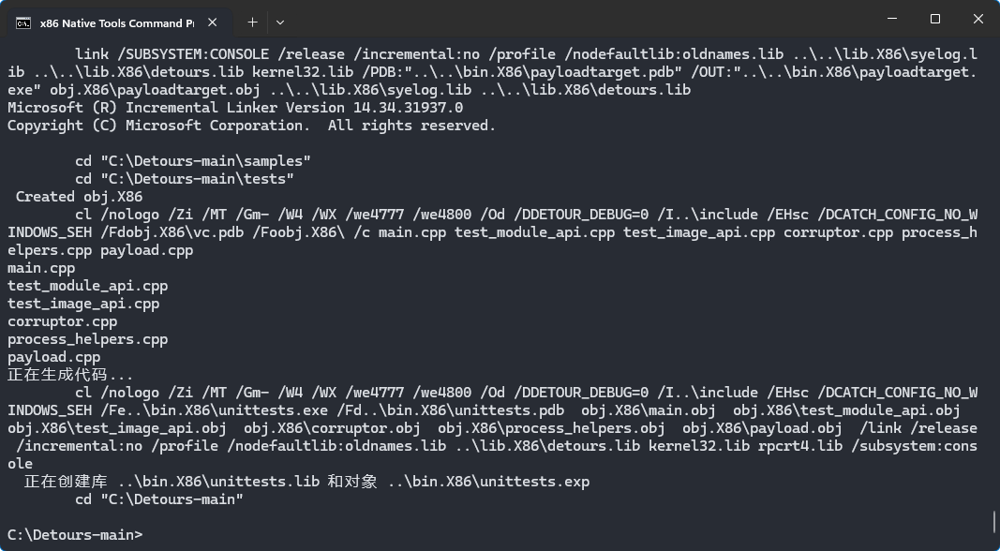


当前目录下多出下面几个文件夹：

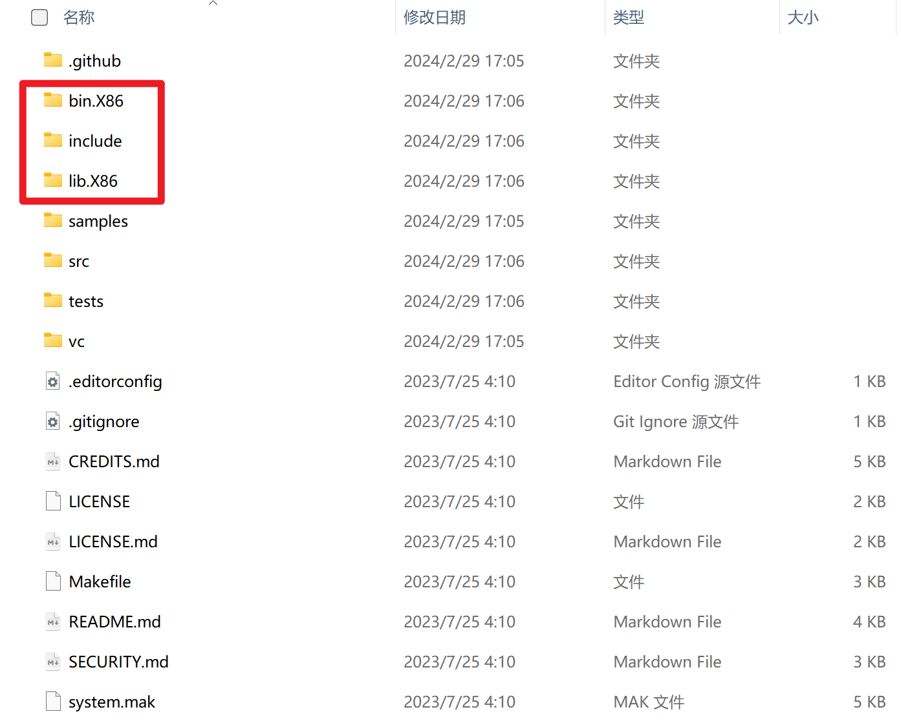


如果使用x86 Native Tools Command Prompt for VS 2022编译Detours库出现报错，请参考这个链接尝试解决问题：https://github.com/microsoft/vcpkg/issues/4882


> 请确保您在 Visual Studio 中安装了以下三个工作负载！然后尝试重新安装它！
>
> 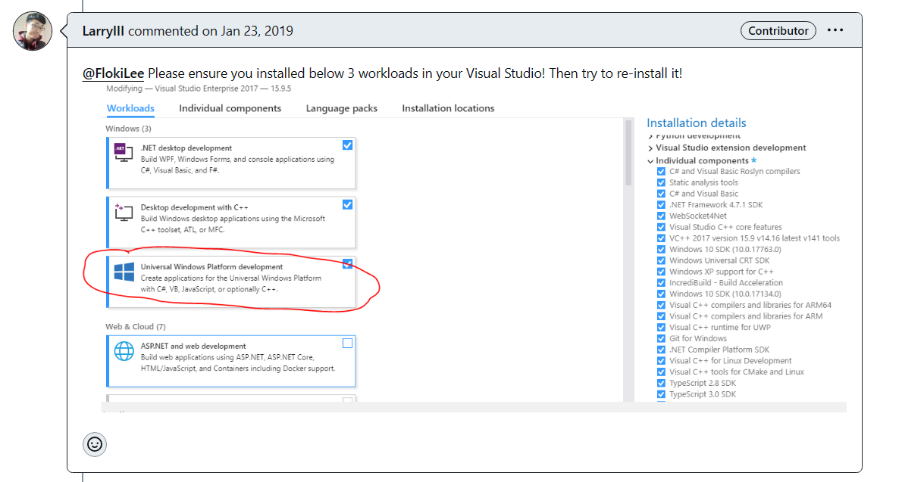


当在Visual Studio 2019的项目需要使用Detours库的时候，请在项目属性中添加include和lib库的位置，这样detours库的配置就完成了。

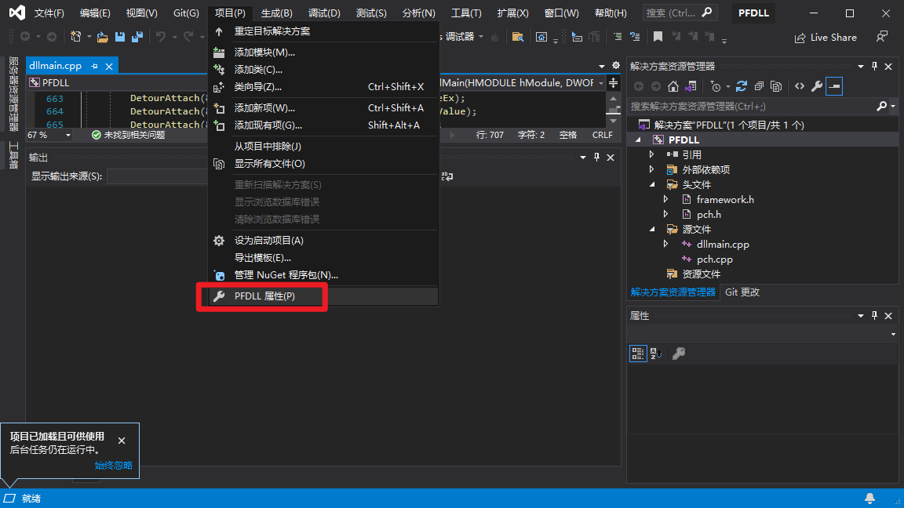

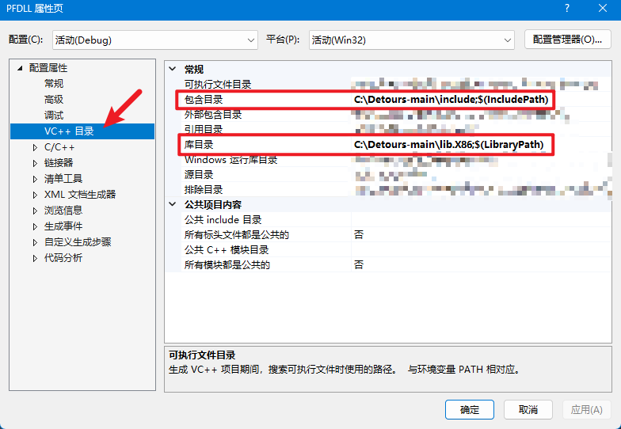


## testCode


记得加入Detours库，方法参考上文Detours配置过程。

testCode组件在Debug x86下直接编译即可运行，如果出现问题请关闭杀毒软件后重试。


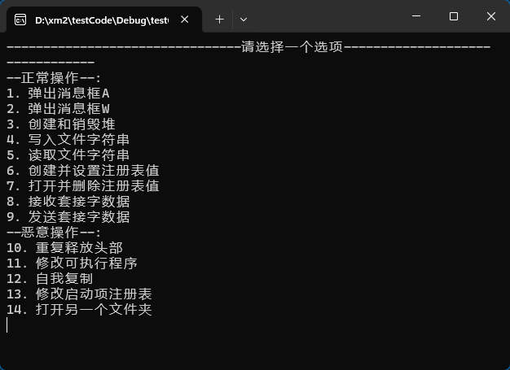


如果出现scanf安全问题，请参考链接：https://blog.csdn.net/qq_58725256/article/details/126897013


本人采用的方法是将SDL关闭：

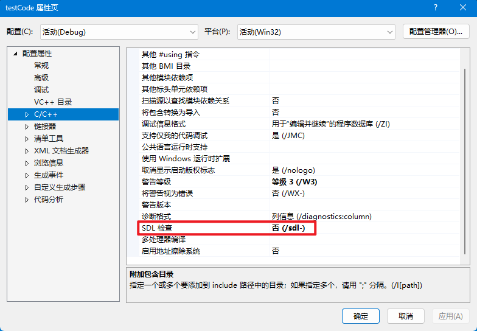


## PFDLL


记得加入Detours库，方法参考上文Detours配置过程。


在Debug x86下直接编译即可，出现如下报错忽略即可：

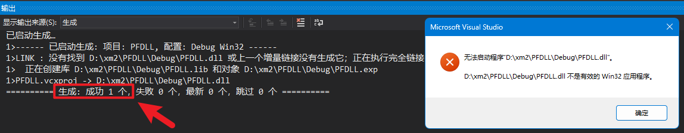


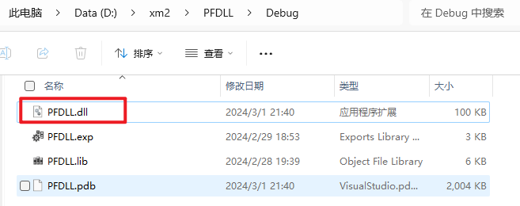

该目录中成功编译出PFDLL.dll即可。


## syringe


记得加入Detours库，方法参考上文Detours配置过程。


在Source.cpp中有几处需要修改的地方，请确定这三个路径均指向有效的文件或者文件夹：

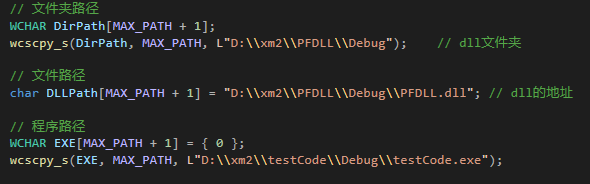


指定正确的路径之后，在Debug x86下直接编译即可，运行syringe.exe结果如下所示：

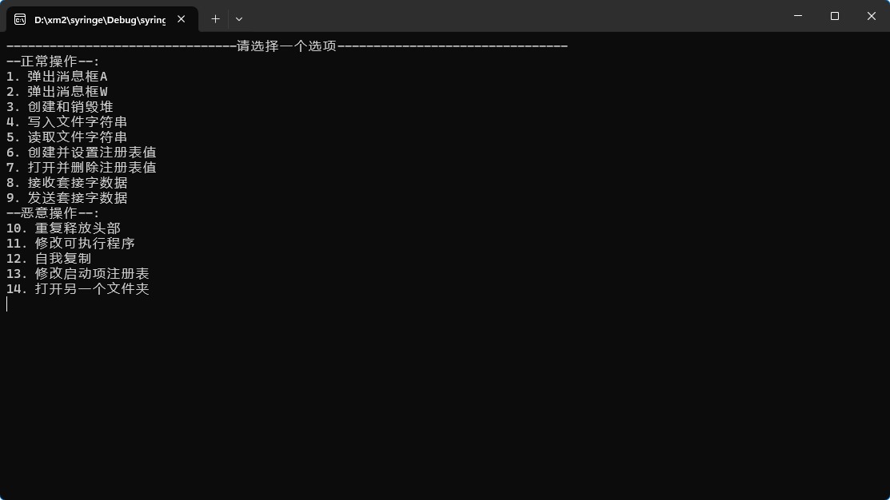


## PFSafetyGuard


记得加入Detours库，方法参考上文Detours配置过程。


在Visual Studio 2019中加入QT插件，具体方法可以参考下面的链接：

https://www.cnblogs.com/xyf327/p/15006500.html

https://blog.csdn.net/yao_hou/article/details/108015209


本人相关设置如下所示：

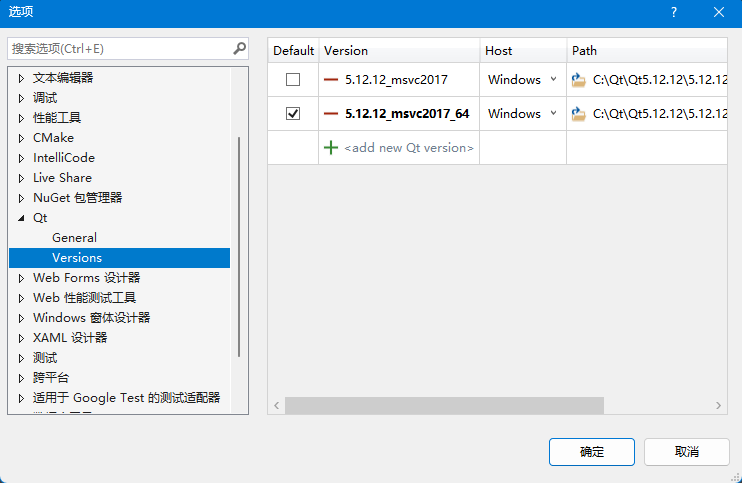


在PFSafetyGuard/PFSafetyGuard/myThread.cpp中修改注射器的路径：

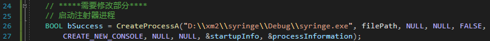


在Debug x86下直接编译即可，运行结果如下所示：

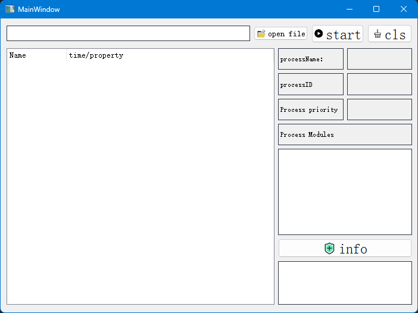


使用open file打开testCode.exe即可。


# 运行结果展示


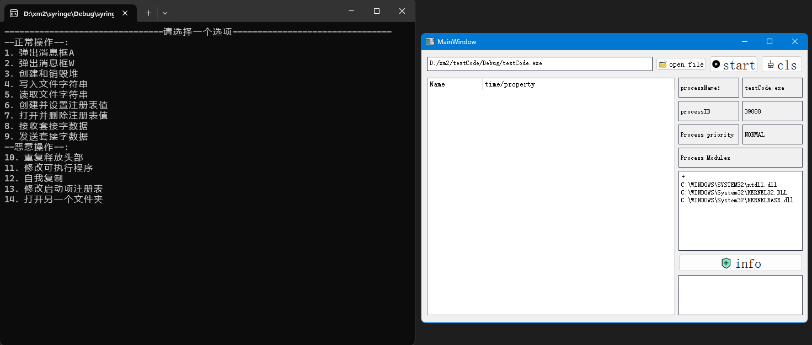

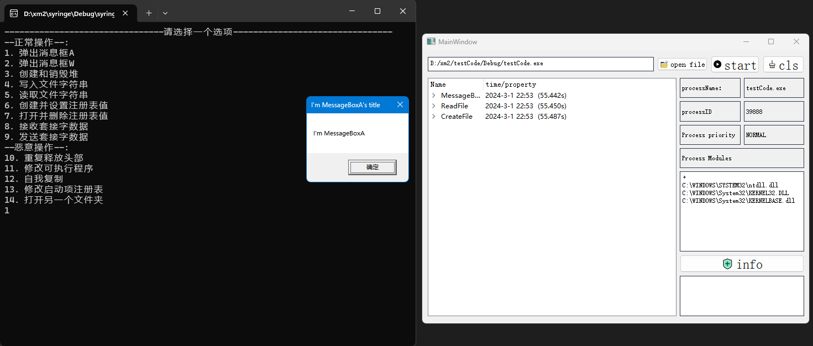