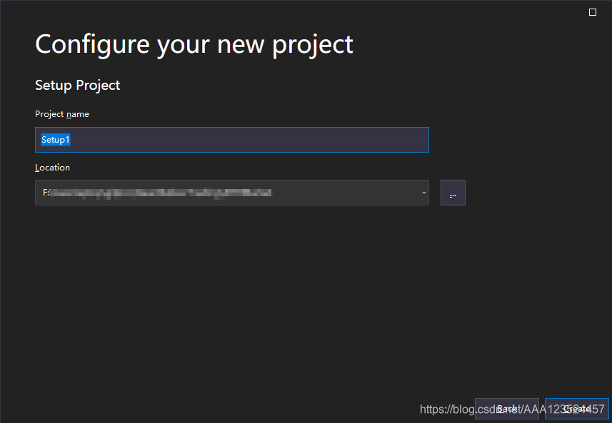
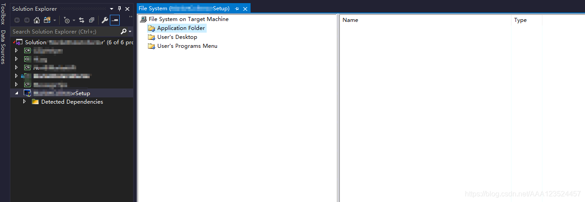

原项目地址：

https://github.com/AgentGuo/PFSafetyGuard


本人成功复现了该项目，简单修改了部分代码，添加了部分注释和说明后重新上传。同时根据自己的调试过程完善了部分文档。


# 运行环境


- Visual Studio 2019
- QT版本：5.12.12
- Detour版本：4.0.1
- 所有代码均在x86下编译通过


# 项目介绍


该项目有四个组成部分：

1. testCode：测试程序，主要包含一些我们需要抓取的API和异常操作
2. PFDLL：定义了需要HOOK的winAPI和替换的函数
3. syringe：注射器程序，主要将PFDLL程序中的替换函数替换测试程序testCode中的API
4. PFSafetyGuard：图形界面程序，接收PFDLL程序勾取的信息，然后做一些行为异常分析


# 详细配置过程


## Detour


首先配置Detours


> 参考链接：https://blog.csdn.net/weixin_44338712/article/details/115261358


首先在[Detours-github](https://github.com/microsoft/detours)下载Detours源码，然后解压，得到以下内容：


在当前目录下，使用**x86** Native Tools Command Prompt for VS 2022执行命令：


```
nmake /f Makefile
```


编译成功：


当前目录下多出下面几个文件夹：


如果使用x86 Native Tools Command Prompt for VS 2022编译Detours库出现报错，请参考这个链接尝试解决问题：https://github.com/microsoft/vcpkg/issues/4882


> 请确保您在 Visual Studio 中安装了以下三个工作负载！然后尝试重新安装它！
>
> 


当在Visual Studio 2019的项目需要使用Detours库的时候，请在项目属性中添加include和lib库的位置，这样detours库的配置就完成了。


## testCode


记得加入Detours库，方法参考上文Detours配置过程。

testCode组件在Debug x86下直接编译即可运行，如果出现问题请关闭杀毒软件后重试。


如果出现scanf安全问题，请参考链接：https://blog.csdn.net/qq_58725256/article/details/126897013


本人采用的方法是将SDL关闭：


## PFDLL


记得加入Detours库，方法参考上文Detours配置过程。


在Debug x86下直接编译即可，出现如下报错忽略即可：


该目录中成功编译出PFDLL.dll即可。


## syringe


记得加入Detours库，方法参考上文Detours配置过程。


在Source.cpp中有几处需要修改的地方，请确定这三个路径均指向有效的文件或者文件夹：


指定正确的路径之后，在Debug x86下直接编译即可，运行syringe.exe结果如下所示：


## PFSafetyGuard


记得加入Detours库，方法参考上文Detours配置过程。


在Visual Studio 2019中加入QT插件，具体方法可以参考下面的链接：

https://www.cnblogs.com/xyf327/p/15006500.html

https://blog.csdn.net/yao_hou/article/details/108015209


本人相关设置如下所示：


在PFSafetyGuard/PFSafetyGuard/myThread.cpp中修改注射器的路径：


在Debug x86下直接编译即可，运行结果如下所示：


使用open file打开testCode.exe即可。


# 运行结果展示


# VS2019打包教程


> 参考链接：https://blog.csdn.net/AAA123524457/article/details/107999588


step1：安装VS2019项目打包插件installer Projects

VS2019默认不包含整个插件，需要先安装VS2019的官方认可打包插件(Microsoft Visual Studio Installer Projects)，如果已安装，请跳过该步骤，通过添加添加扩展插件的方式进行添加(菜单栏：Extensions->Manage Extensios)


在online板块，搜索installer Projects，找到Microsoft Visual Studio Installer Projects，并下载安装；注意安装后，需要关闭VS，同时重启计算机才能生效。


step2:添加打包项目

右键总项目，是solution，非project。


设置打包项目的名称，和保存路径，然后点击创建(create)



创建之后，就会看到一个空的打包项目




step3:添加需要打包的项目

右键Application Folder 添加主项目输出，意思是添加需要打包生成可执行文件的主项目(我的工程里面有5个子项目，只有其中一个是主执行程序，其他是支持主程序的配件、接口等起到支持作用的子项目，以DLL或者子exe的方式进行支持)


在这里选择主项目作为输出项目


点击OK之后，可以发现原本Application Folder中还是空的目录一下子多了很多库文件，这些就是主项目中的依赖项目，包括之前的4个作为支持的子项目


step4:查漏补缺
一般情况下，进行step3就可以把主项目的所有依赖都添加进来了，但是也有一些特殊情况。比如其他子项目中用到了一些第三方库，在主项目中并没有通过References的方式进行添加，而是通过build event事先直接拷贝的运行目录的，这类文件都需要添加进来。方法很简单，直接打开主项目的编译输出目录，对比Application Folder中的打包库，看看哪些确实的，添加进来就行了。

比如我的主项目中有个7z的压缩支持动态库，就没有添加到Application Folder的打包库中。


这时就需要手动添加进来，再次右键Application Folder，以添加文件的方式把7z.dll添加进来


step5:创建安装程序的快捷方式

在Application Folder中，找到Primary output from xxx(项目名称) (Active) ,类型是Output。右键，创建一个快捷方式：


把这个创建的快捷方式，剪切到User's Destktop目录


然后对这个快捷方式进行重命名，名字你喜欢，默认的名称太长了。还可以给这个快捷方式设置logo图标(icon)


同样的，如果你想把程序添加到程序菜单栏，用同样的方式创建快捷方式进行导入设置即可，这里不再复述


step6:添加卸载程序

经过step1~step5就已经完成了项目的打包了，已经可以进行bulid和安装了。本章节是一个额外章节，没有也可以的。但是没有添加卸载程序的话，程序安装之后，以后想卸载只能在操作系统的控制面板->程序和功能中进行卸载。所以本章节不要也可以。

在Application Folder中添加windows的官方卸载支持包：C:\Windows\System32\msiexec.exe


添加进来后，用同样的方式，创建卸载程序的快捷键


同样，重命名一下，一般卸载程序的快捷键只需要添加到系统菜单栏就行了，没必要添加到桌面。当然系统菜单栏还可以添加目录的，名字你喜欢就好。


接下来要设置卸载程序生效，那就需要绑定卸载程序的产品代码。选中打包项目，在右侧的属性窗口中，有个ProductCode的属性，把这串代码拷贝出来。


回到刚才创建的卸载程序快捷方式中，选中。在右侧的Arguments中，输入：/x {F507FA38-D483-4F6F-9194-A9EF9892B69D}


到此，卸载程序就安装好了


step7:安装包基础配置

包括安装目录，说明，兼容性等。选中打包项目，在属性窗口中，设置作者的名称，安装目录名称，是否给所有用户安装，安装目标平台的兼容性(32/64位系统)等


step8:编译生成打包安装程序


编译完之后，在输出目录就生成了用于安装的打包程序了：


然后就可以安装了。如果项目按照到C盘，或者需要操作C盘的目录，则需要用管理员的方式启动，否则会出现权限访问导致程序出错的问题。

 

> 另有参考链接：https://blog.csdn.net/h2763246823/article/details/117625804


# 本项目打包过程